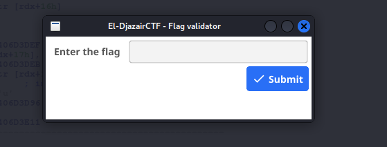
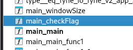
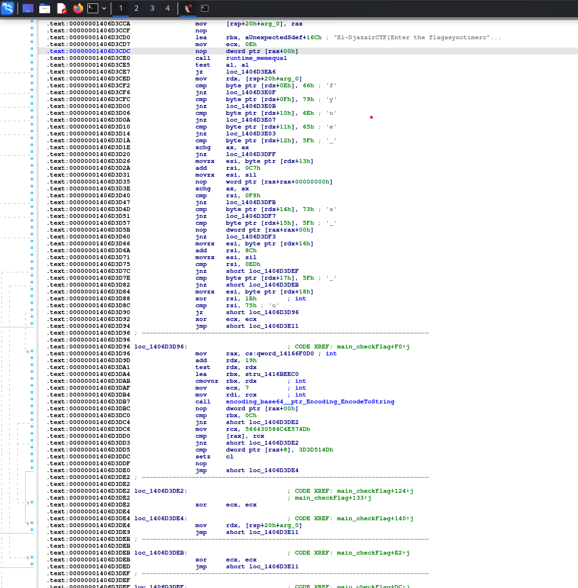

From the file name we can understand that this is a .exe file, though we should run the basic file check
```bash
└─$ file GoGetIt.exe 
GoGetIt.exe: PE32+ executable (GUI) x86-64 (stripped to external PDB), for MS Windows, 12 sections
```
Next we ran the exe using wine, a PE executor for linux. We see 



A basic flag checker app, next we proceed to reverse this exe

For this challenge i used IDA, ghidra didnt disassembled it well\
From IDA and since the challenge checks for a flag we just search for "flag", this function was found 



Next we disassemble this function and see



A basic function that checks for a flag that were given as input\
Next we just give it to chatgpt (vibe CTFing), unless you have time decode it yourself (goodluck for that x)

## El-DjazairCTF{fyne_1s_a_n1ce_GU1_lib_f0r_g0lanG}

